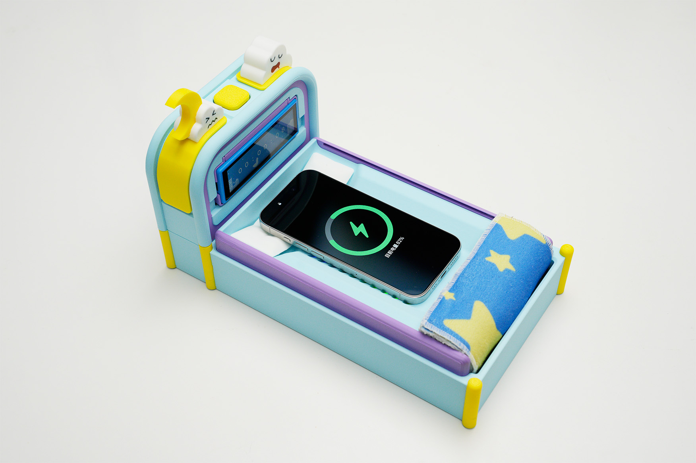
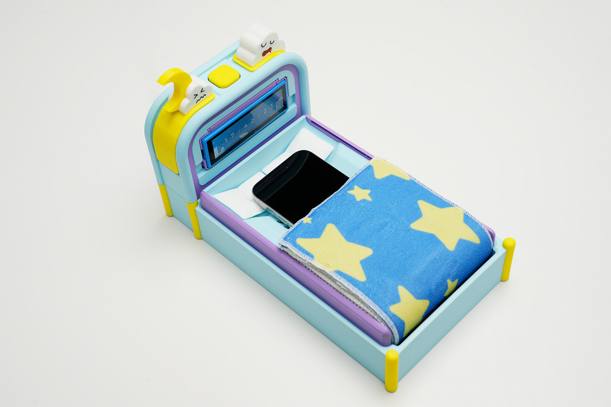
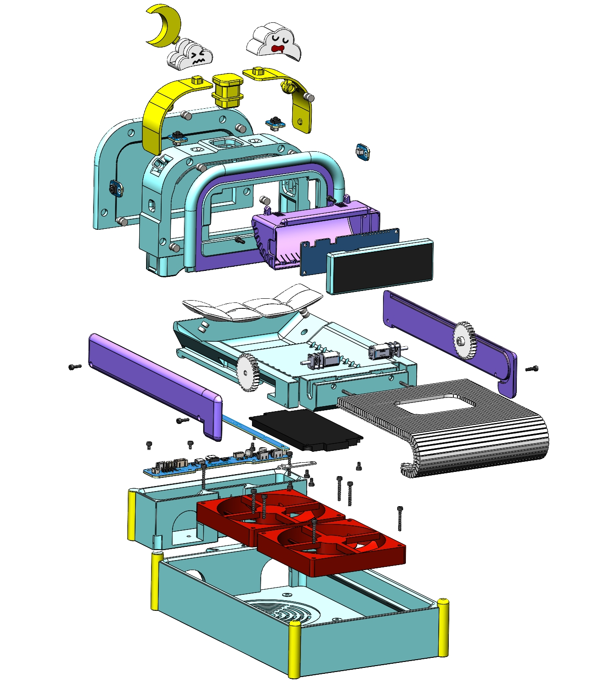
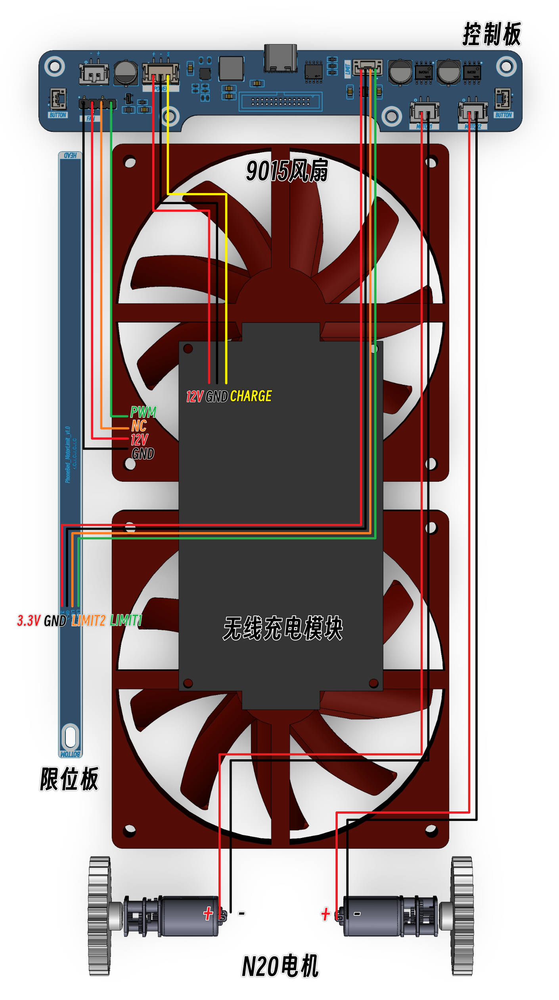
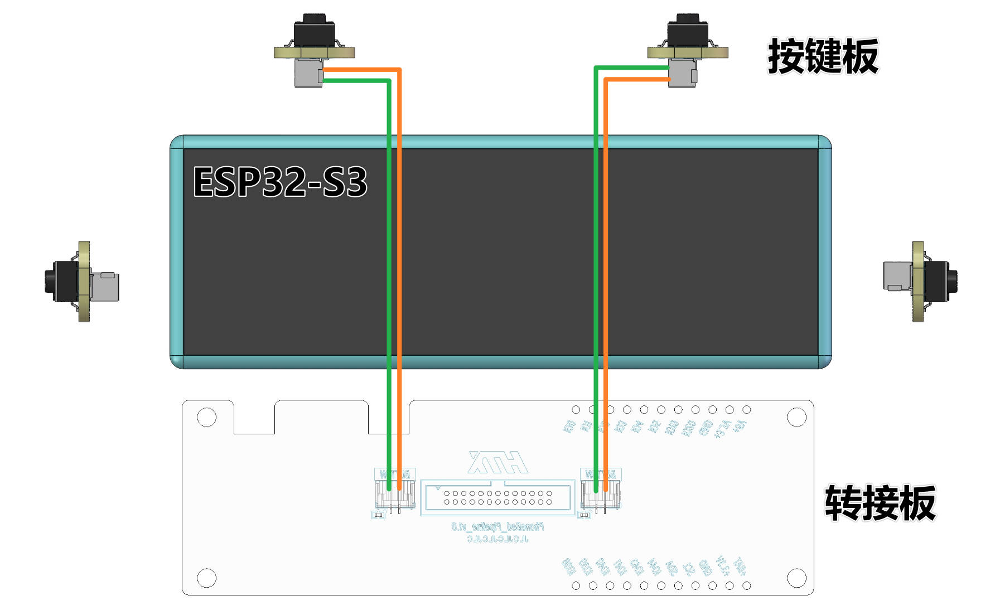

# **PhoneBed**

> 为了不把手机带上床，我们给它也做了张床。

视频参考：[为了不熬夜玩手机，我们做了这个...](https://www.bilibili.com/video/BV1LQwkzvEtZ)

硬件开源：[HTXStudio手机床](https://oshwhub.com/htx-studio/PhoneBed)

[GitHub repository](https://github.com/htx-studio/PhoneBed)

[Gitee repository](https://gitee.com/htxstudio/PhoneBed)

3D模型：[MakerWorld](https://makerworld.com.cn/zh/models/2327961-htx-shou-ji-chuang#profileId-2633052)

本项目使用ESP-IDF开发， 采用[Waveshare ESP32-S3-Touch-LCD-3.49B-EN](https://www.waveshare.net/shop/ESP32-S3-Touch-LCD-3.49B-EN.htm)开发板，开发环境搭建可以参考[这里](https://docs.espressif.com/projects/esp-idf/zh_CN/v5.5.1/esp32s3/get-started/index.html)

本仓库的资料内容包括：

* 4块PCB的立创EDA工程
* 工程源码
* 注意事项等

> 注：该仓库仅手机床基础功能，与视频效果略有差异。

## 仓库目录结构

#### Docs（文档）

数据手册与图片

#### Code（代码）

ESP-IDF v5.5.1工程源码

#### Hardware（硬件）

嘉立创EDA的项目文件

## 功能介绍

将手机放入手机床内，开始为手机充电的同时“盖好被子”，只有闹钟响才能“叫醒”你的手机。

#### 时间页面（默认）

中心区域显示当前时间

下方的鸽子在闹钟未开启时显示鸽子觅食，闹钟开启时鸽子会回巢休息

> * 左键长按：切换闹钟配置页面

#### 闹钟配置页面

使用按键或触摸的方式设置闹钟

左侧滚轮为小时，右侧滚轮为分钟，两个滚轮中间的两个小箭头指示当前正在使用按键修改哪一个值

左侧云朵显示闹钟是否开启，开启时会有弹窗提示

> * 左键短按：选中项时间加 1
> * 左键双击：切换闹钟修改索引（小时、分钟、无修改）
> * 左键长按：切换时间页面
> * 右键短按：选中项时间减 1
> * 右键双击：设置闹钟开启或关闭
> * 右键长按：选中项时间加 10

#### 闹钟响铃页面

如果你不关闭它，它将一直响下去

> * 左键短按：关闭闹钟
> * 右键短按：关闭闹钟

## 制作指南

### 模型

[MakerWorld](https://makerworld.com.cn/zh/models/2327961-htx-shou-ji-chuang#profileId-2633052)

### PCB：

1-Adapter（转接板）：板材FR-4，板厚1.6mm，双层板

> 注意弹簧针的压缩行程匹配（板间4mm），且针头直径大于1.2mm。建议安装在转接板并拧紧螺丝后，使用烙铁对弹簧针焊盘加焊一遍，防止接触不良

2-Controller（控制板）：板材FR-4，板厚1.6mm，双层板

3-Button（按键板）：板材FR-4，板厚1.6mm，双层板

4-MotorLimit（限位板）：板材FR-4，板厚1.6mm，双层板，焊接GH1.25 4P连接线，注意线序

### 其它物料清单：

|                  | 用量 |                        备注                        |
| :--------------- | :--: | :------------------------------------------------: |
| 打印好的模型     |  -  |                     PLA，PETG                     |
| PCBA             |  4  |           转接板，控制板，按键板，限位板           |
| 开发板           |  1  | Waveshare ESP32-S3-Touch-LCD-3.49B-EN（拆除后壳） |
| 无线充电模块     |  1  | 无线充电模块，注意指示灯信号为3.3v信号 |
| GA12-N20减速电机 |  2  |                         -                         |
| 9015散热风扇     |  2  |                         -                         |
| 风扇一拖二线材   |  1  |                         -                         |
| IDC排线          |  1  |        1.27mm间距，26p(2*13p)，长20cm，同向        |
| GH1.25双头线     |  2  |                  2p，长10cm，同向                  |
| GH1.25单头线     |  1  |                     4p，长20cm                     |
| PH2.0单头线      |  2  |                     2p，长40cm                     |
| PH2.0单头线      |  1  |                     3p，长40cm                     |
| N52圆形钕铁硼磁铁 |  25 |              直径6mm 厚度3mm                       |
| 内六角M3*6mm     |  8  |                        -                           |
| 内六角M2.5*4mm   |  17 |                        -                           |
| 内六角M2.5*8mm   |  6  |                        -                           |
| 内六角M2.5*18mm  |  2  |                        -                           |

### 接线

> 请使用QC/PD充电器为设备供电。

> 安装被子前建议通电后将手机放入床中，使电机工作，以检查电机旋转方向是否正确

> 四个按键板安装槽位，任选2个进行安装即可。正视屏幕，左侧为左按键，右侧为右按键。

> 注：转接板与控制板上下对应的BUTTON接口功能相同

---

如果有什么不足欢迎大家批评指正，感谢大家。

## 引用

LVGL.[GitHub repository](https://github.com/lvgl/lvgl)

MultiButton.[GitHub repository](https://github.com/0x1abin/MultiButton/tree/master)

微雪电子.[GitHub repository](https://github.com/waveshareteam/ESP32-S3-Touch-LCD-3.49)
